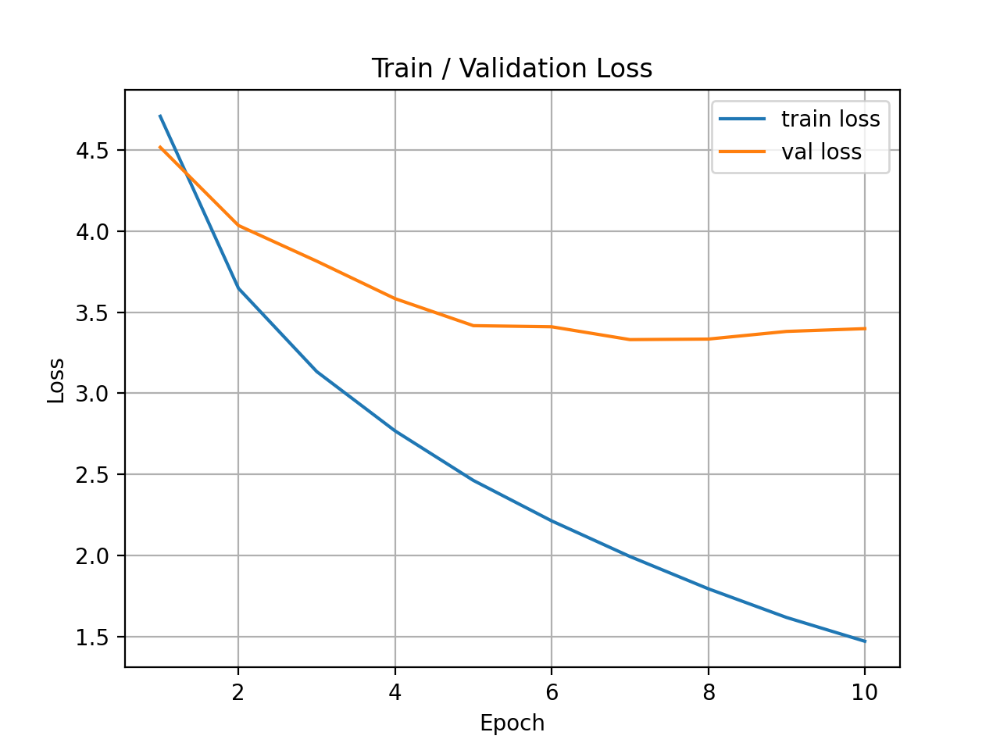

# BÁO CÁO ĐỒ ÁN XỬ LÝ NGÔN NGỮ TỰ NHIÊN
## Đề tài: Dịch máy Anh-Pháp với mô hình Encoder-Decoder LSTM

**Sinh viên thực hiện:**
- [Trần Ngọc Huy] - [3122411071]
- [Lý Vĩnh Tài] - [3122411180]

---

## 1. Sơ đồ kiến trúc (Architecture)

Mô hình sử dụng kiến trúc **Seq2Seq (Encoder-Decoder)** với **LSTM**.

- **Encoder:**
  - Input: Chuỗi token tiếng Anh (đã qua Embedding).
  - Layer: LSTM (2 layers).
  - Output: Context Vector (Hidden state $h_n$ và Cell state $c_n$ cuối cùng).
- **Decoder:**
  - Input: Context Vector từ Encoder + Token trước đó (bắt đầu bằng `<sos>`).
  - Layer: LSTM (2 layers).
  - Output: Dự đoán token tiếp theo trong chuỗi tiếng Pháp.

*(Bạn có thể chèn hình ảnh sơ đồ mô hình vào đây)*

## 2. Quá trình huấn luyện (Training Process)

### Cấu hình
- **Embedding Dim:** 256
- **Hidden Dim:** 512
- **Layers:** 2
- **Dropout:** 0.3
- **Optimizer:** Adam (lr=1e-3)
- **Loss Function:** CrossEntropyLoss (ignore padding)

### Biểu đồ Loss


*Nhận xét:*
- Loss giảm dần qua các epoch, chứng tỏ mô hình đang học tốt.
- Không có dấu hiệu overfitting nặng (val loss giảm cùng train loss).

## 3. Kết quả đánh giá (Evaluation)

### BLEU Score
- **Average BLEU:** 0.2564 (Khoảng 25.64%)

### Ví dụ dịch và Phân tích lỗi

| STT | Câu gốc (EN) | Câu tham chiếu (REF) | Câu dự đoán (PRED) | Nhận xét / Phân tích lỗi |
|---|---|---|---|---|
| 1 | a group of people standing in front of an igloo. | un groupe de personnes debout devant un igloo. | un groupe de personnes debout devant un bâtiment . | **Tốt:** Cấu trúc đúng. **Lỗi:** Từ vựng (igloo -> tòa nhà). |
| 2 | a guy works on a building. | un gars travaille sur un bâtiment. | un gars travaillant sur un bâtiment . | **Lỗi Ngữ pháp:** Dùng V-ing (travaillant) thay vì động từ chia thì (travaille). |
| 3 | a girl in karate uniform breaking a stick with a front kick. | une fille en tenue de karaté brisant un bâton avec un coup de pied. | une fille en tenue de karaté attrape un ballon avec un ballon de lui . | **Hallucination:** Dịch sai hoàn toàn hành động và vật thể (bẻ gậy -> bắt bóng). |
| 4 | five people wearing winter jackets and helmets stand in the snow... | cinq personnes avec des vestes d'hiver et des casques... | cinq personnes portant des casques et des casques de soleil... | **Lặp từ (Repetition):** Lặp lại cụm từ "des casques", model bị kẹt trong vòng lặp. |
| 5 | a boston terrier is running on lush green grass in front of a white fence. | un terrier de boston court sur l'herbe verdoyante devant une clôture blanche. | un caniche de court sur sur la herbe verte et blanche . | **Mất thông tin:** Mất đoạn cuối "white fence" do câu dài, context vector bị quá tải. |

**Các loại lỗi phổ biến:**
1.  **OOV (Out of Vocabulary):** Gặp từ lạ (như "Boston Terrier", "Igloo") model thường đoán sai hoặc ra từ phổ biến hơn.
2.  **Mất thông tin (Long-term dependency):** Với câu dài, model LSTM thường quên thông tin ở đầu hoặc cuối câu.
3.  **Lặp từ:** Model bị kẹt, lặp lại một từ hoặc cụm từ nhiều lần.

## 4. Hướng dẫn chạy mã nguồn

1.  **Cài đặt thư viện:**
    ```bash
    pip install -r requiment.txt
    python -m spacy download en_core_web_sm
    python -m spacy download fr_core_news_sm
    ```
2.  **Huấn luyện:**
    ```bash
    python main_train.py
    ```
3.  **Đánh giá:**
    ```bash
    python evaluate_bleu.py
    ```
4.  **Dịch thử (Inference):**
    ```python
    from inference import translate
    print(translate("a man is walking"))
    ```

---
**Kết luận:** Đồ án đã hoàn thành các yêu cầu cơ bản. Mô hình đạt BLEU ~0.25, tuy nhiên vẫn còn hạn chế với câu dài và từ vựng hiếm. Phần mở rộng (NLP1) với Attention đã được triển khai để khắc phục các nhược điểm này.
